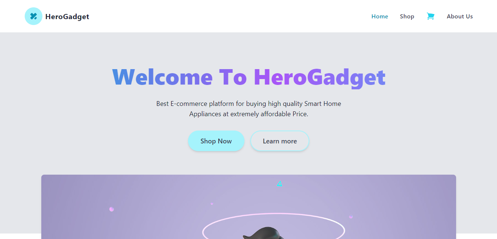
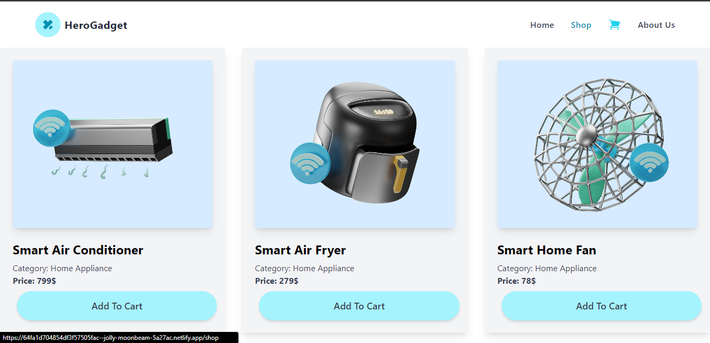

```markdown
# Gadgets Hero




Gadgets Hero is a web application built with React.js, JavaScript, Vite, React Router DOM, and Tailwind CSS. It offers a seamless shopping experience for gadget enthusiasts, providing features like browsing products, adding items to the cart, and learning more about the team behind the project.

## Live Demo

Check out the live demo: [Gadgets Hero Live](https://64fa1d704854df3f57505fac--jolly-moonbeam-5a27ac.netlify.app/)

## Features

- **Home**: Discover the latest gadgets and featured products.
- **Shop**: Browse a wide range of gadgets available for purchase.
- **Cart**: Add items to your cart and review your selections.
- **About Us**: Learn more about the creators and contributors behind Gadgets Hero.

## Installation

To run this project locally, follow these steps:

1. Clone the repository:

   ```bash
   git clone https://github.com/maheefaisal/gadgetshero.git
   ```

2. Navigate to the project directory:

   ```bash
   cd gadgetshero
   ```

3. Install dependencies:

   ```bash
   npm install
   ```

4. Start the development server:

   ```bash
   npm start
   ```

5. Open your web browser and visit `http://localhost:3000` to view the application.

## Contributing

We welcome contributions from the community. If you'd like to contribute to Gadgets Hero, please follow our [Contributing Guidelines](CONTRIBUTING.md).

## Issues

If you encounter any issues or have suggestions for improvements, please [open an issue](https://github.com/maheefaisal/gadgetshero/issues).

## License

This project is licensed under the MIT License. See the [LICENSE](LICENSE) file for details.

## Contact

- **Gadgets Hero Website**: [https://64fa1d704854df3f57505fac--jolly-moonbeam-5a27ac.netlify.app/](https://64fa1d704854df3f57505fac--jolly-moonbeam-5a27ac.netlify.app/)
- **GitHub Repository**: [https://github.com/maheefaisal/gadgetshero](https://github.com/maheefaisal/gadgetshero)

Thank you for checking out Gadgets Hero! We hope you enjoy exploring the world of gadgets with us.
```

Make sure to replace `insert_image_link_here` with the actual image link of your website. You can create a new file called `CONTRIBUTING.md` if you want to specify contribution guidelines, and include any other relevant details or sections as needed.